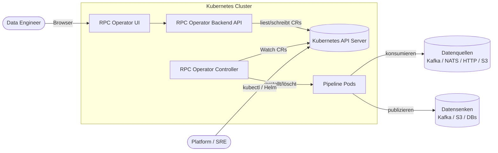
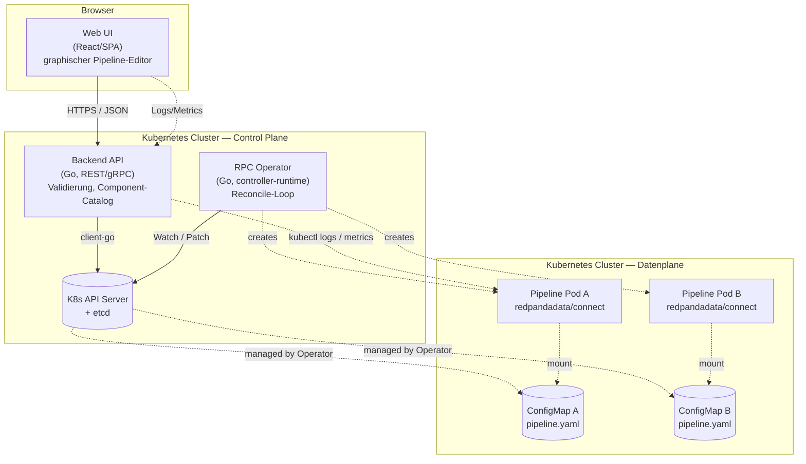
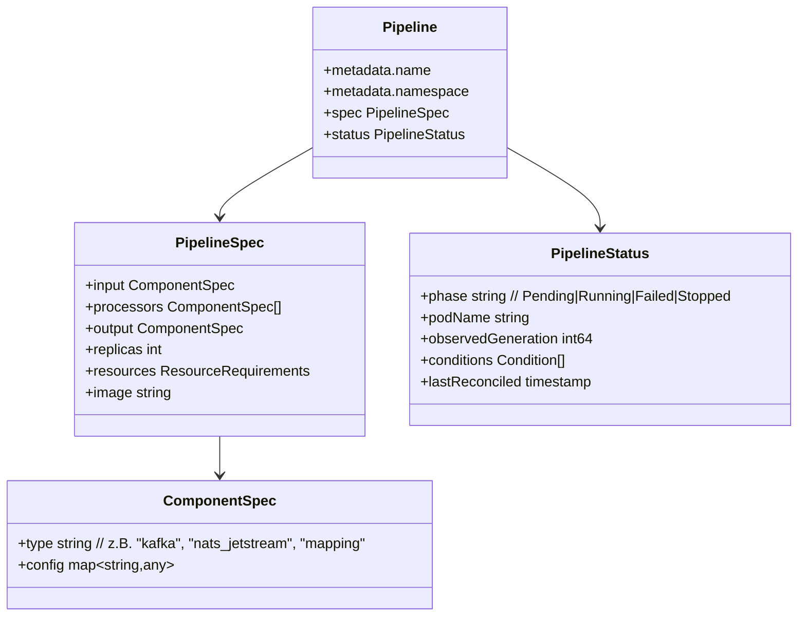
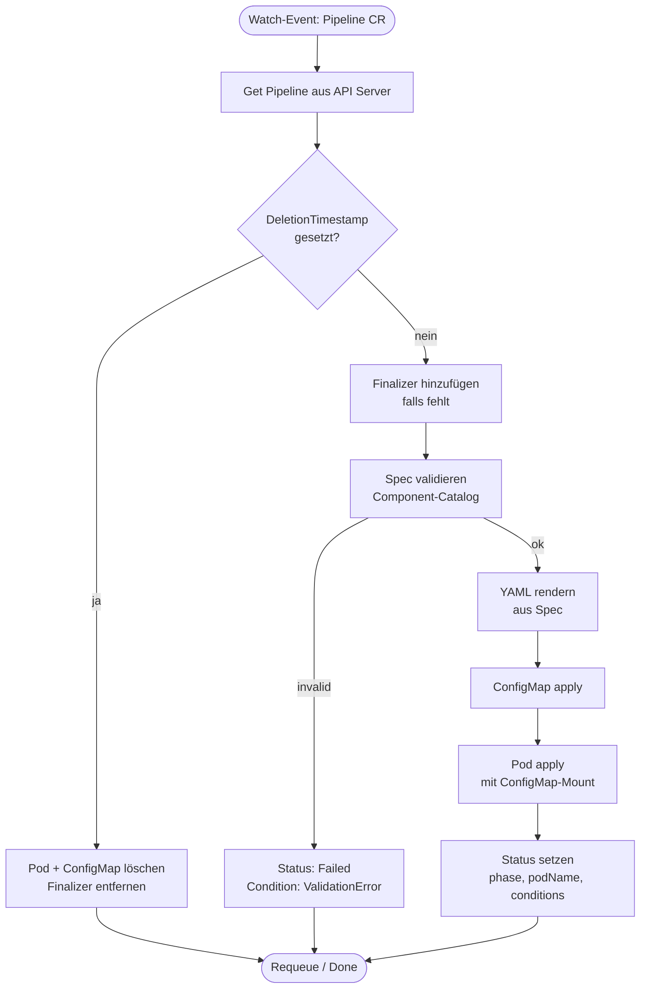
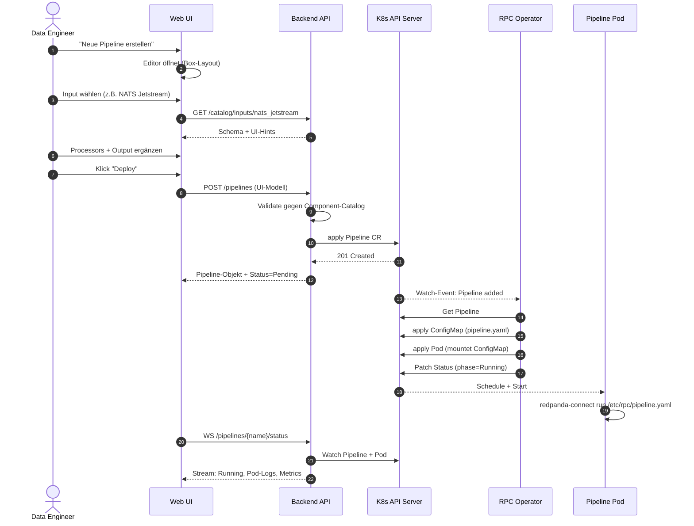
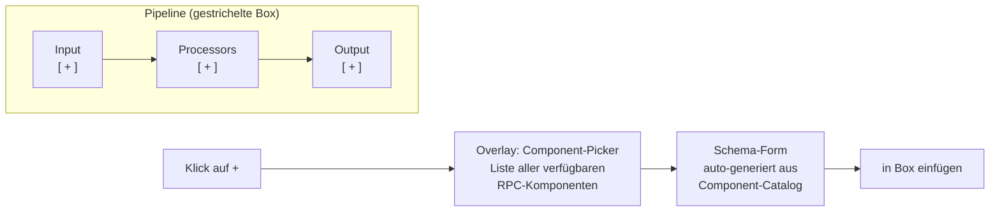

# Redpanda Connect Operator (RPC Operator) — Architektur

**Rolle:** Senior Software Architekt
**Status:** Initialer Entwurf (v0.1) — iterativ, Feature by Feature
**Scope:** Technisches Design + PoC für die Ausführung von Redpanda Connect Pipelines in Kubernetes mit UI-gestütztem Monitoring & Konfiguration.

---

## 1. Executive Summary

Der **RPC Operator** ist ein Kubernetes-Operator, der **Redpanda Connect (RPC) Pipelines** als deklarative Custom Resources verwaltet und sie als isolierte Pods im Cluster betreibt. Eine begleitende **Web UI** erlaubt Data Engineers das graphische oder YAML-basierte Erstellen, Deployen und Monitoren von Pipelines (Input → Processors → Output) — ohne direkten `kubectl`-Zugriff.

**Kernideen:**

- **Deklarativ:** Jede Pipeline ist eine `Pipeline` Custom Resource (CR). Die Wahrheit liegt in etcd, nicht in der UI-Datenbank.
- **Ein Pod pro Pipeline:** Klare Isolation, einfache horizontale Skalierung, klare Failure-Domains.
- **Reconcile-Loop:** Operator gleicht Ist- ↔ Soll-Zustand kontinuierlich ab.
- **UI als Client:** Backend-API ist ein dünner Layer über der Kubernetes-API; CRs sind das gemeinsame Vokabular.
- **RPC Community Image:** Pipeline-Pods nutzen das offizielle `redpandadata/connect` Image, gemounted mit der generierten YAML-Config.

**Nicht-Ziele (v0.1):**

- Multi-Cluster-Federation
- Persistente State-Stores für stateful Processors
- Authn/Authz jenseits einfacher RBAC-Integration
- HA des Operators (Single-Replica reicht für PoC)

---

## 2. System-Kontext (C4 Level 1)



**Akteure:**

| Akteur | Aufgabe |
|---|---|
| Data Engineer | Erstellt, deployed, monitort Pipelines via UI |
| Platform / SRE | Installiert Operator (Helm), verwaltet Cluster-RBAC |
| Kubernetes API Server | Source of Truth für alle CRs |
| Externe Systeme | Datenquellen/-senken der Pipelines |

---

## 3. Container-Sicht (C4 Level 2)



**Komponenten:**

| Container | Zweck | Tech |
|---|---|---|
| **Web UI** | Pipeline-Editor (Boxen-Layout: Input/Processor/Output), Status-Dashboard, Log-Viewer | React + ReactFlow / SVG; Monaco für YAML-Mode |
| **Backend API** | Validiert Pipelines, übersetzt UI-Modell ↔ CR, streamt Logs/Metrics, bedient Component-Catalog | Go, `client-go`, REST + WebSocket |
| **RPC Operator** | Reconciler für `Pipeline` CR; verwaltet Pods, ConfigMaps, Status-Felder | Go, `controller-runtime` (kubebuilder/Operator SDK) |
| **Pipeline Pod** | Führt eine konkrete RPC-Konfiguration aus | `redpandadata/connect:latest` |
| **ConfigMap** | Trägt die generierte `pipeline.yaml` an den Pod | Kubernetes nativ |

---

## 4. Custom Resource Definition

Eine Pipeline ist vollständig durch ihre CR beschrieben. Die UI erzeugt CRs; der Operator konsumiert sie.



**Beispiel-CR:**

```yaml
apiVersion: rpc.operator.io/v1alpha1
kind: Pipeline
metadata:
  name: uppercase-demo
  namespace: data-eng
spec:
  replicas: 1
  input:
    type: stdin
    config: {}
  processors:
    - type: mapping
      config:
        mapping: "root = content().uppercase()"
  output:
    type: stdout
    config: {}
status:
  phase: Running
  podName: uppercase-demo-7f9c
  observedGeneration: 3
```

Aus dieser CR generiert der Operator die RPC-konforme `pipeline.yaml`:

```yaml
input:
  stdin: {}
pipeline:
  processors:
    - mapping: "root = content().uppercase()"
output:
  stdout: {}
```

---

## 5. Reconcile-Loop des Operators



**Wichtige Eigenschaften:**

- **Idempotent:** Jeder Reconcile-Durchlauf ist sicher wiederholbar (`apply`-Semantik via Server-Side Apply).
- **Owner References:** ConfigMap & Pod tragen den Pipeline-CR als Owner → automatisches Garbage-Collecting bei CR-Delete.
- **Finalizer:** `rpc.operator.io/finalizer` schützt vor Pod-Waisen, falls externe Cleanup-Schritte nötig werden.
- **Status als Source of Truth für UI:** Die UI pollt/streamt `status` — keine eigene Statushaltung nötig.

---

## 6. End-to-End-Flow: Pipeline erstellen & deployen



---

## 7. UI-Konzept (Pipeline-Editor)



- **Zwei Modi:** Visual (Boxen) ↔ YAML (Monaco-Editor); bidirektional synchron.
- **Component-Catalog:** Backend exponiert die Liste aller RPC-Komponenten + JSON-Schema → UI rendert Formulare automatisch (kein hartcodiertes UI pro Komponente).
- **Live-Validierung:** UI ruft `POST /pipelines/validate` vor dem Deploy.

---

## 8. Sicherheits- & Betriebsaspekte

| Thema | Ansatz (v0.1) |
|---|---|
| **Authn/Authz** | UI/API authentifiziert via OIDC; Backend nutzt User-ServiceAccount-Impersonation für K8s-Calls → native RBAC pro Namespace |
| **Secrets** | Pipeline-Configs referenzieren `secretKeyRef` statt Klartext; Operator mountet entsprechend |
| **Pod-Sicherheit** | `runAsNonRoot`, `readOnlyRootFilesystem`, eigene RestrictedPodSecurityStandard-konforme Defaults |
| **Resource-Limits** | Pflicht in CR; Operator weist Default zu, falls fehlt |
| **Observability** | RPC exponiert Prometheus-Metrics auf `:4195/metrics`; ServiceMonitor pro Pipeline-Pod |
| **Logs** | UI streamt via `kubectl logs`-Equivalent (Backend → K8s API) |

---

## 9. Roadmap (iterative Features)

| Iteration | Feature | Akzeptanzkriterium |
|---|---|---|
| **v0.1 PoC** | CRD + minimaler Operator + stdin/stdout-Pipeline | `kubectl apply` einer Pipeline → laufender Pod |
| **v0.2** | Backend-API + Component-Catalog (statisch) | UI kann CRs via API erstellen |
| **v0.3** | UI: Box-Editor + YAML-Modus | E2E: Klick "Deploy" → Pipeline läuft |
| **v0.4** | Status-Dashboard + Log-Streaming | Live-Logs in UI sichtbar |
| **v0.5** | Metrics-Integration (Prometheus) | Throughput-Graph pro Pipeline |
| **v0.6** | Multi-Tenancy via Namespaces + RBAC | User sieht nur eigene Pipelines |
| **v1.0** | HA-Operator, Audit-Log, Versionierung von Pipelines | Produktionsreife |

---

## 10. Offene Fragen

1. **Pipeline-Versionierung:** Behalten wir Historie der CRs (z.B. via separate `PipelineRevision` CR) oder reicht etcd-History?
2. **Stateful Processors:** Wie behandeln wir Komponenten, die persistent State brauchen (z.B. Cache, Aggregations-Buffer)? PVC pro Pod?
3. **Skalierung > 1 Replica:** Für welche Input-Typen ist horizontale Skalierung sicher (Kafka mit Consumer-Groups: ja; HTTP-Server: nein)? Catalog muss das markieren.
4. **Hot-Reload vs. Rolling-Restart:** RPC unterstützt SIGHUP-Reload — wollen wir das nutzen, oder bei Spec-Änderung den Pod neu rollen?
5. **YAML ↔ UI-Modell-Mapping:** 1:1 oder erlauben wir UI-spezifische Annotationen (z.B. Layout-Hints)? Vorschlag: separater Annotations-Block in CR.
